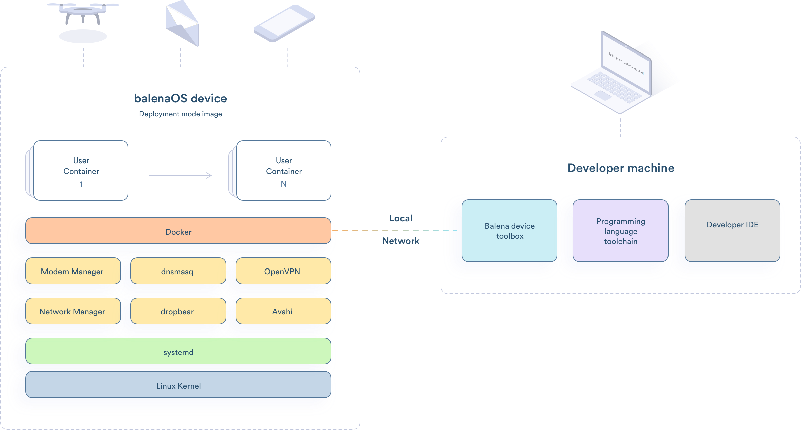

**Run Docker containers on embedded devices**

## Highlights

- __Tailored for containers__: Containers will revolutionize connected devices, and balenaOS is the best way to run them.
- __Built to last anywhere__: Made to survive harsh networking conditions and unexpected shutdowns.
- __Just the essentials__: A minimal Linux with the services needed to run Docker reliably on an embedded device - nothing else.
- __Easy to port__: Based on Yocto Linux for easy porting to most capable device types across varied CPU architectures.
- __Fast, modern workflow__: Who said embedded software has to be slow and painful to develop?
- __Open and friendly__: Actively developed in the open; community participation
  warmly welcomed.

## Motivation

In our quest to build [balenaCloud](https://balena.io/cloud), a platform that brings the tools of modern software development to the world of connected hardware, we started by porting Docker to ARM chips in 2013. We soon realised that we also needed an operating system optimized for the use case: a minimal OS ideal for running containers on embedded devices.
BalenaOS supports almost 20 distinct device types, has a robust networking and provisioning story, emphasizes reliability over long periods operation, and enables a productive developer workflow. We’ve been running balenaOS as part of the balenaCloud platform for years and are now releasing it as an independent operating system, so that others can benefit and contribute to running containers on connected devices.

## Contributing

Do you want to help make balenaOs better? Take a look at our [Contributing Guide](https://balena.io/os/contributing). Hope to see you around!

## License

balenaOs is free software, and may be redistributed under the terms specified in the [license](https://github.com/balena-os/balena-os/blob/master/LICENSE).

Links:

* [Feature request / Report a bug](https://github.com/balena-os/balena-os/issues)
* [Documentation](https://balena.io/os/)
* [meta-balena](https://github.com/balena-os/meta-balena) - *meta-balena is a Yocto layer used to build balena operating system images*
* [Contribute to balena.io/os website](/CONTRIBUTING.md)
